# 오전 : 작업 환경설정
1. JDK 1.8 설치
2. 환경변수 설정
3. 이클립스 웹 개발 프로젝트로 설치
4. WAS(Tomcat9.0)
5. SQL Developer(Jdk8 포함 버전 설치, 회사 내부 Db에 연결 오라클 따로 설치X)

# 오후 XPLATFORM
1. 기본 Hello 프로젝트 생성
    - Base 생성(Hello)
    - 오른쪽 Properties -> appearance -> text로 버튼 이름 변경
    - 번개표시로 event 생성(클릭 등)
2. 스태틱, 그리드 div 생성
3. 방향키시 10픽셀씩 컨트롤 누르면 1픽셀씩 쉬프트누르면 크기 조정
4. 바인딩(Dataset과 컴포넌트 연결) -> Dataset 클릭 원통모양 -> 드래그하면 밑에 invisable objects 에 표시 -> 더블클릭해서 Columns 추가하고 Rows에 임시 데이터 적음 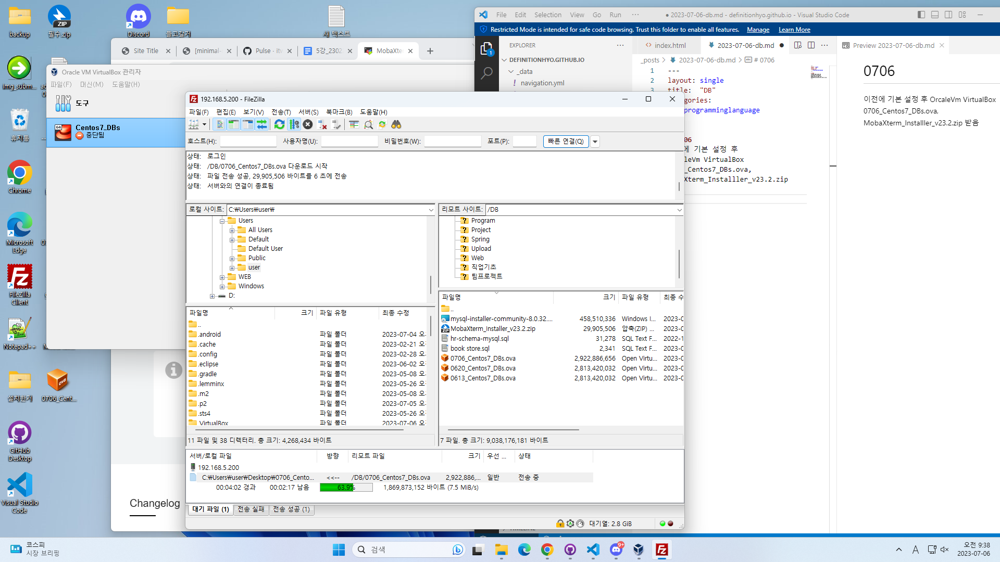 -> 그리드 더블클릭
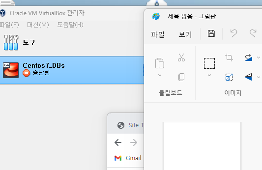
-> 그리드 누르고 Binding -> binddataset 누르면 그리드 모양바뀜 ->
그리드 다시 더블클릭  
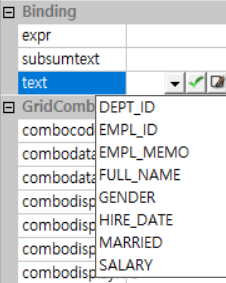
Name 컬럼에는 FullName 선택
-> 있는 데이터 나옴(Dataset과 컴포넌트 연결, 코딩량 줄여줌)
-> edit(입력창) 선택후 properties에서 Bind Info -> Appearance -> value에서 dataset선택 컬럼 선택하면 자동으로 데이터 연결됨 -> f6눌러서 확인하면 연결된 데이터는 표시됨
5. 표시 안되는 데이터들 maskedit, radio, combo (radio, combo는 코드성 데이터가 필요함)
6. maskEdit은 숫자는#, 문자는A로 properties-> mask에서 지정해줘야함 
7. raido -> Properties -> Binding -> innerdataset
8. combo -> dataset하나 더 추가 후
Bindint-> dataset 고르고 codecolumn과 datacolumn 설정

# 팀장님 오후 SQL
1. 이클립스에 xplatform 관련 jar, xml파일 web-inf -> lib 추가
2. xplatform 버튼 url 추가
3. save url은 project explorer -> typeDefinition에서 추가 후 간단하게 표시
4. 실제로 insert 안됨 -> married checkbox 넘어갈때 true false 라서 안됨 DB는 Y N 형식 -> 체크박스 Properties -> Appearance -> falsevalue, truevalue 변경
5. select 도 transaction 으로 변경 -> 3번째 인자 공백, 4번째 ds_employees=ds_employees 으로 변경

# 넥사크로 14버전 설치

# 넥사크로로 XPLATFORM 했던거 만들기

# 09.24 오전
1. 어제 하던거 완료
2. 콤보는 .value로 값 가져옴
3. 스크립트 pdf로 추가하고 수정, jsp 쿼리구문도 수정
4. 한글 오류떠서 메서드(unito뭐시기) 삭제후 name으로만 사용

# 09.25 오후
1. xplatform 디버그 인강
2. alert, trace, Debugging
3. 이미지 넣는법
    - 기본적으로 버튼 생성후 properties -> background -> image
    -  ADL -> default -> insert
    - GlobalVariables -> Images에 넣기
    - 두가지 버튼중 ... 으로 바로 삽입
4. CSS
5. 신세계이엔씨 클레임 관련 실무 프로젝트 흐름 공부

# 09.25 오전 xplatform 동영상 강의 
1. sdi -> mainframe -> childframe -> form : 하나의 화면
2. mdi : 여러개의 화면 vframeset:수직 h~:수평 frameset:자유공간 / 크기조절 : 해당 frameset의 Misc.separatesize로 설정 ex)200,* / 타이틀바로 못움직이게 고정시키려면 ChildFrame의 Misc.showtitlebar -> false변경
3.xPlatform 에서 왼쪽 메뉴창 트리형태는 그리드로 만들어서 Dataset 넣고 body 클릭후 Action -> disaplaytype 변경

# 09.25 오후 Websquare5 인강
https://www.youtube.com/watch?v=KEPuK3erXWM&list=PL7a9HhkvOVb09T_2Xdxs4sPgyDjkGlT9G&index=1
## 1강
- WebContent폴더 하위에서 xml로 만들지만 실행될떄는 wpack의 js파일로 실행됨(있어야함, 없으면 project->rebuilding)  

meta 적혀있으면 거의 설명

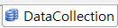
dataset에 해당  
단건의 구조 : dataMap  
다건의 구조 : dataList  
  
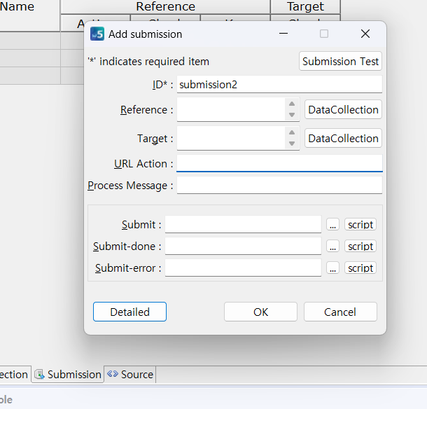  
ajax처럼 주고받는 데이터    

- 컴포넌트 Property에서 id 설정해야함 

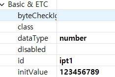
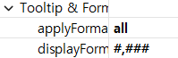  
applyformat : 적을때도 포맷이 유지되게  
displayForm : #,### = 3자리마다 , 출력  
이벤트 : 컴포넌트 누르고 이벤트 -> 스크립트  
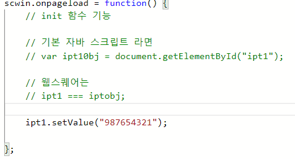
속성 initValue(123456789)에 값이 있어도 스크립트에 정의된 함수를 먼저 읽고(실행x) 생성 후 속성 적용 -> onpageload 적용 -> 987654321  

## 2강
출력 관련
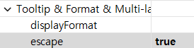
 akt+enter로 2줄로 입력 해놓으면 true일때 br태그 표시됨   
false일때  
- escape는 입력된 문자의 태그를 치환해줌 / 일반적으로는 스크립트 공격 방지를 위해 치환하지않음 / 출력에서만 이용가능  
 
앱스퀘어에서 부르는 컴포넌트 이름   
- 단순한 콤보 =  selectBox  
- 버튼 = trigger  
- div = group  
- mdi = windowcontainer
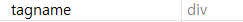 tagname은 모든 html 태그 가능 default=div  
그룹 클릭후 inputbox등 삽입가능  
- grid = gridview
 

멀티 업로더의 경우 기본 mdoe 는 flash지만 현재 사용하지않음  
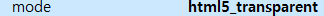변경해서 사용    
웹스퀘어에서는 iframe 잘 사용하지 않음 대신 WFrame사용
Wframe=include하는 형태 하나의 페이지안에 모든 영역 띄움  
그리드뷰 이용시 드릴다운 사용, 데이터만 계층형 사용할때는 트리 사용  
팝업 : 요즘은 Layer Popup 자주 사용 
--- 
### Design -> Outline -> Head : 화면과 같이 데이터 볼수있음   
DataColletion -> map list 마우스오른쪽 type변경으로 바꿀수있음   
드래그로 바인딩 가능
---

유튜브 강의하는 사람이 source탭은 이용 안하는게 좋다고 얘기함  

css,js 컴포넌트에 드래그로 가능(head,source에서 확인 가능)

## 3강
