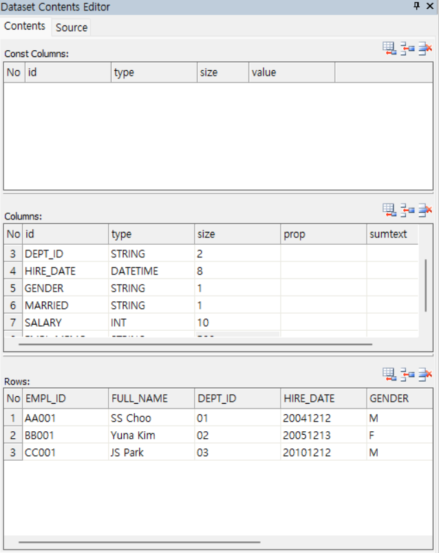
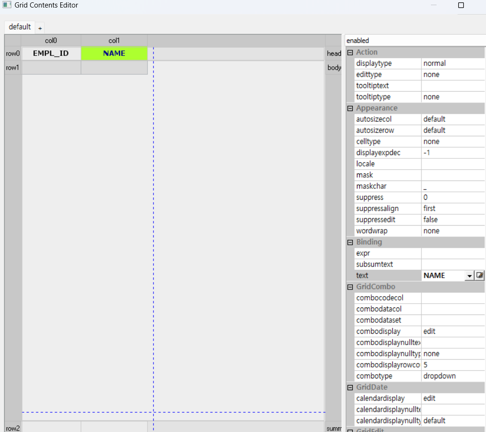
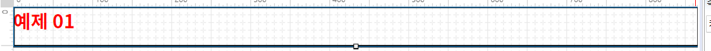
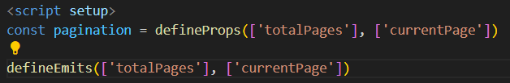
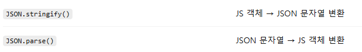

# 오전 : 작업 환경설정
1. JDK 1.8 설치
2. 환경변수 설정
3. 이클립스 웹 개발 프로젝트로 설치
4. WAS(Tomcat9.0)
5. SQL Developer(Jdk8 포함 버전 설치, 회사 내부 Db에 연결 오라클 따로 설치X)

# 오후 XPLATFORM
1. 기본 Hello 프로젝트 생성
    - Base 생성(Hello)
    - 오른쪽 Properties -> appearance -> text로 버튼 이름 변경
    - 번개표시로 event 생성(클릭 등)
2. 스태틱, 그리드 div 생성
3. 방향키시 10픽셀씩 컨트롤 누르면 1픽셀씩 쉬프트누르면 크기 조정
4. 바인딩(Dataset과 컴포넌트 연결) -> Dataset 클릭 원통모양 -> 드래그하면 밑에 invisable objects 에 표시 -> 더블클릭해서 Columns 추가하고 Rows에 임시 데이터 적음  -> 그리드 더블클릭

-> 그리드 누르고 Binding -> binddataset 누르면 그리드 모양바뀜 ->
그리드 다시 더블클릭  

Name 컬럼에는 FullName 선택
-> 있는 데이터 나옴(Dataset과 컴포넌트 연결, 코딩량 줄여줌)
-> edit(입력창) 선택후 properties에서 Bind Info -> Appearance -> value에서 dataset선택 컬럼 선택하면 자동으로 데이터 연결됨 -> f6눌러서 확인하면 연결된 데이터는 표시됨
5. 표시 안되는 데이터들 maskedit, radio, combo (radio, combo는 코드성 데이터가 필요함)
6. maskEdit은 숫자는#, 문자는A로 properties-> mask에서 지정해줘야함 
7. raido -> Properties -> Binding -> innerdataset
8. combo -> dataset하나 더 추가 후
Bindint-> dataset 고르고 codecolumn과 datacolumn 설정

# 팀장님 오후 SQL
1. 이클립스에 xplatform 관련 jar, xml파일 web-inf -> lib 추가
2. xplatform 버튼 url 추가
3. save url은 project explorer -> typeDefinition에서 추가 후 간단하게 표시
4. 실제로 insert 안됨 -> married checkbox 넘어갈때 true false 라서 안됨 DB는 Y N 형식 -> 체크박스 Properties -> Appearance -> falsevalue, truevalue 변경
5. select 도 transaction 으로 변경 -> 3번째 인자 공백, 4번째 ds_employees=ds_employees 으로 변경

# 넥사크로 14버전 설치

# 넥사크로로 XPLATFORM 했던거 만들기

# 09.24 오전
1. 어제 하던거 완료
2. 콤보는 .value로 값 가져옴
3. 스크립트 pdf로 추가하고 수정, jsp 쿼리구문도 수정
4. 한글 오류떠서 메서드(unito뭐시기) 삭제후 name으로만 사용

# 09.25 오후
1. xplatform 디버그 인강
2. alert, trace, Debugging
3. 이미지 넣는법
    - 기본적으로 버튼 생성후 properties -> background -> image
    -  ADL -> default -> insert
    - GlobalVariables -> Images에 넣기
    - 두가지 버튼중 ... 으로 바로 삽입
4. CSS
5. 신세계이엔씨 클레임 관련 실무 프로젝트 흐름 공부

# 09.25 오전 xplatform 동영상 강의 
1. sdi -> mainframe -> childframe -> form : 하나의 화면
2. mdi : 여러개의 화면 vframeset:수직 h~:수평 frameset:자유공간 / 크기조절 : 해당 frameset의 Misc.separatesize로 설정 ex)200,* / 타이틀바로 못움직이게 고정시키려면 ChildFrame의 Misc.showtitlebar -> false변경
3.xPlatform 에서 왼쪽 메뉴창 트리형태는 그리드로 만들어서 Dataset 넣고 body 클릭후 Action -> disaplaytype 변경

# 09.25 오후 Websquare5 인강
https://www.youtube.com/watch?v=KEPuK3erXWM&list=PL7a9HhkvOVb09T_2Xdxs4sPgyDjkGlT9G&index=1
## 1강
- WebContent폴더 하위에서 xml로 만들지만 실행될떄는 wpack의 js파일로 실행됨(있어야함, 없으면 project->rebuilding)  

meta 적혀있으면 거의 설명

dataset에 해당  
단건의 구조 : dataMap  
다건의 구조 : dataList  
  
  
ajax처럼 주고받는 데이터    

- 컴포넌트 Property에서 id 설정해야함 

  
applyformat : 적을때도 포맷이 유지되게  
displayForm : #,### = 3자리마다 , 출력  
이벤트 : 컴포넌트 누르고 이벤트 -> 스크립트  

속성 initValue(123456789)에 값이 있어도 스크립트에 정의된 함수를 먼저 읽고(실행x) 생성 후 속성 적용 -> onpageload 적용 -> 987654321  

## 2강
출력 관련

 akt+enter로 2줄로 입력 해놓으면 true일때 br태그 표시됨   
false일때  
- escape는 입력된 문자의 태그를 치환해줌 / 일반적으로는 스크립트 공격 방지를 위해 치환하지않음 / 출력에서만 이용가능  
 
앱스퀘어에서 부르는 컴포넌트 이름   
- 단순한 콤보 =  selectBox  
- 버튼 = trigger  
- div = group  
- mdi = windowcontainer
 tagname은 모든 html 태그 가능 default=div  
그룹 클릭후 inputbox등 삽입가능  
- grid = gridview
 

멀티 업로더의 경우 기본 mdoe 는 flash지만 현재 사용하지않음  
변경해서 사용    
웹스퀘어에서는 iframe 잘 사용하지 않음 대신 WFrame사용
Wframe=include하는 형태 하나의 페이지안에 모든 영역 띄움  
그리드뷰 이용시 드릴다운 사용, 데이터만 계층형 사용할때는 트리 사용  
팝업 : 요즘은 Layer Popup 자주 사용 
--- 
### Design -> Outline -> Head : 화면과 같이 데이터 볼수있음   
DataColletion -> map list 마우스오른쪽 type변경으로 바꿀수있음   
드래그로 바인딩 가능
---

유튜브 강의하는 사람이 source탭은 이용 안하는게 좋다고 얘기함  

css,js 컴포넌트에 드래그로 가능(head,source에서 확인 가능)

# 09.26 오전
## 3강 화면그리기
- css 
- static position 절대적인 좌표X 그려진 순서대로 그리는 방법
- absolute position : 절대적인좌표를 가지고 있음
- relative position : 중간단계 
- fixed , sticky : 고정좌표
 확인가능 default = static  
- static일때는 크기만 표시, 좌표값 X -> 그래서 옮기지못함
  
 눌러서 그리기모드 변경(static -> absolute)  
- absolute 하면 컴포넌트 하나마다 포지션값을 조절해야됨 -> 작업시간 오래걸림 -> static으로 작성함 
- 제목 컴포넌트 : textbox  
- css 도와주는 툴 있음, window -> preference -> websquare -> show style toolbar menu 체크 -> apply and close  
 width 제거하면 화면에 가득참  
height 제거시 텍스트 크기값으로 나타냄(자식노드 따라감)  
 버튼을 오른쪽으로 옮기고 싶으면 div(웹스퀘어에서는 group)-> 컴포넌트 클릭후 그룹으로 감싸기 -> -> float 특성상 위쪽으로 나옴(감싸는 범위를 벗어남)-> 부모객체를 overflow 해줘야함 -> outline group 클릭 -> properties -> style 에서 작성 , padding 으로 안쪽으로 여유공간, margin으로 바깥으로 공간  
- group 선택후 tablelayout 컴포넌트 -> 기준객체 뒤에 추가  
팔레트뷰어 이용안해도 해당 그룹 클릭후 스페이스 클릭-> 자주사용하는 컴포넌트  
- 안쪽으로 들여쓰기 ->
 그룹화 후 padding 적용  
- 라벨칸이 큰 경우 : th(아무칸) 더블 클릭 후  td 더블클릭 후  width 제거하면
  
- 범위전체를 수정하려면 테이블 컴포넌트 클릭 후 f2클릭하면 상위 범위로 올라감 or outline 에서 선택
- 적응형 ui 변경  adptive -> layout 변경, adaptiveThreshold 900으로 변경 -> 창을 줄였을때 유동적으로 변함(적응형ui)
- 강사 : 웹스퀘어는 일일히 안함 외울 필요 X-> DesignSystem(css 적용되어있음) -> 00  페이지시작(그룹 자동) -> 02 페이지타이틀 -> 03 조회조건  
- templte -> 신규페이지로 만들어짐

## 4강 DataCollection과 Submission 처리방법
- 사용해야되는 컴포넌트에 id 설정
- 스크립트 -> 웹스퀘어에서 제공하는 유틸성자원(유틸성api) -> $p. 객체 사용
- 콤보박스, 체크박스, 라디오 -> 목록 세팅해줘야함(더블클릭), 인풋박스등은 더블클릭 해도 안나옴 -> lavel 값은 상관x value값은 01 02 ... 으로 맞추는게 좋음 통신객체에 매핑 위해    
 alloption-전체, chooseoption-선택  
- alloption : 빈값 선택 X, 강사:우리들은거의안씀
- chooseoption : 빈값 O, 빈칸 출력 : $blank
- 하드코딩(더블클릭후 직접)추가도 가능 but api활용 가능  
인덱스 생략시 선언된 순서대로, 0부터 출력  
- 보통 row 1
- 역할은 데이터 객체 만들어서 연결실습(직급=하드코딩, 성별=스크립트), 목록 세팅=List로 생성  
BindItemSet 체크해야 데이터객체 이용가능 Label=name, Value=code 선택  
use data 체크 필수  
- use data 체크 해제 후 스크립트에서 json, xml등으로 데이터 저장가능  
 append 변경해줘야함 기본은 default / true -> 뒤에 붙인다 false -> 대체  
- json 스크립트를 많이 이용
- BindItemSet 체크 해제하고 bind 방법 -> API를 통한 bind(동적) 이것도 많이 사용함  
  
### submission(통신)
  
중요한부분 : Reference, target, URL Action
- Reference : 리퀘스트 정보(이미만들어진 데이터 객체중 선택)
- target : response 같음
- URL Action : 데이터를 얻어올 서블릿 주소
- 강의: 로컬파일루트로 해봄 이미지 참조
send 후 Create DataCollection -> 생성해줌 -> 만든 데이터 Target에 추가 / 지금은 구조상 reference 확인 못함  
 전처리, 에러처리는 거의 공통개발자가 해줌 우리같은 단위 개발자는 보통 callback  
- 조회 버튼 누르면 통신(submission)하도록
- submission의 ID는 전역으로 올라가지 않음(다른거는 올라감) -> $p이용 -> $p.executeSubmission();  
- ctrl+마우스오른쪽 -> 현재화면 디버그 실행 후 다시 조회하면  
  
- 데이터 객체와 연결할때(결과를 input같은곳에 가져올때, ex:이름, 가입일) ref 속성 이용(종류가 너무 많아 구별 어려움) -> outline ->datacollection -> 선택 후 KeyInfo -> 해당하는 데이터를 드래그로 이동  
Emp_NM 드래그로 이름 InputBox에 -> 바인딩(왼쪽 위에 초록색 작은 네모) 됨  
- DataList 붙여넣기 가능 ex) edu 폴더 training1_info.txt 복사후 data객체 클릭후 그냥 붙여넣기(데이터 문서 있을때) 
- 이 방식과 아까 submission 통신해서 데이터 있으면 create Datacollection 방식있음, 직접추가도 있음

## 5강 DataCollection 과 gridView 연동
  
- 바인딩 할때 신규생성 하면 자동으로 열 행 추가  
- 전체속성, 컬럼속성있으면 컬럼속성 적용됨 ex)그리드뷰 readonly속성 false, 사번밑 컬럼 readonly true  
### 그리드뷰 속성들
- autofit기능 : 채워줌
- fitMinWidth : autofit 적용되는 최소한의 크기 여부 지정  
- fixedColumn : autofit이 풀릴때 고정되어있을 컬럼
- cloumnMove : 컬럼위치 변경 가능하게   
sortable : 정렬기능 가능 여부(true후 헤더 더블클릭) -> 헤더 개별속성으로 sort 개별여부 가능  
filter : 헤더 개별속성에서 가능
usefilterlist : 그리드뷰 에서 true
- 헤더에 filter true하고 그리드뷰 userfilterList true 후 헤더 filter 클릭해보면 보고싶은 항복들 체크박스로 필터링함 -> 편리함    
  
- rownumVisible : true 선택시 그리드뷰에 순번 생김 / 속성으로 생긴 컬럼은 클릭 못함 / 헤더에 순번이란느 속성 주고싶으면 -> rowNumHeaderValue  
  
  
-  rowStatusVisible :   수정시 표시해줌  
- rowStatusHeaderValue : rowStatus 헤더에 입력  
- 웹스퀘어에서는 편집하려면 더블클릭 해야함 
- editModelEvent : 그리드뷰 클릭후 onclick 으로 변경
- keyMoveEditMode  : tab으로 이동 후 편집모드 바로 편집모드
- focusFlow : linear로 변경시 마지막 컬럼에서 tab 키 시 다음 행으로 이동
- visibleRowNum : 화면에 표현할 행 수(all X)
- code로 나오는것 속성 inpuyType설정 후 바인딩하면 됨
- viewType : Icon 콤보,달력 편집전에 표시
- displayFormat : 우편번호처럼 ###-###
- displayFormatter : 함수형식 scwin.dis

# 26.오후
## 6강 gridView의 Event 및 API
- 이벤트, API는 그리드 뷰의것을 사용한다
- 컬럼별로는 어떻게 제어하는가?
- 이벤트 스크립트에서 colID 인자를 사용하지만 셀클릭, 더블클릭 밖에없음(인덱스만 있어도 인덱스 사용 X) 
- 인덱스만 있는경우에는 인덱스를 통해 ID를 구해주는 getColumnID(col); 사용 var _colId = this.getColumnID(col);  
  
- 행추가 등 crud에 관련된 데이터들은 스크립트에서 그리드뷰리스트(ui_Memberlist)가 아니라 데이터쪽에서 찾아야함  
 0을 넣으면 맨위에 추가됨, 단순 추가 후 쓰려면 var로 설정  
  
deleteRow는 상태만 삭제, remove는 진짜 삭제
- 보통 delete를 많이씀 crud 한번에 하기위해
  
- modified로 하면 CRUD중 R빼고 다 보냄 = delete 많이씀   
- 다중으로 한번에 지우려고 체크박스 열 추가로 해도 데이터박스와 매핑이 되지 않으므로 disabled되어있음 -> 데이터박스에 추가해줘야함    
- out line -> 데이터에서 추가한 컬럼 선택 -> 속성 -> ignoreStatus -> true로 하면 값이 변하든 말든 상태값에 영향 안줌 -> 체크용으로 사용하는것들은 적용해야함
- 이렇게 삭제하고난 뒤에는 안보이는곳에 저장해놓음 -> var obj <- 에 저장
  
기존데이터 필요없으면  
  setData 빈배열 하면 빈배열로 바꿈(기억X ->메모리 효율성 높아짐)
- 엑셀관련(다운로드 등)은 그리드뷰에 있음 -> ui_memberList
- 파라미터 안주면 에러발생 -> {},[] 처럼 아무거나 줘야함  
  
업로드 하면 헤더도 2번나오고 코드있는곳은 체크가 안되있음 -> JSON 형식으로 업로드하기 위해  
  

- 웹스퀘어의 경우 그리드뷰 에서 각가의 로우 인덱스 클릭하면 안보이는곳에 가상의 단건 데이터를 저장함 -> 마스터 디테일 구조에서 출력하려면 드래그 하면됨 -> 그리드뷰처럼 rowIndex가 있으면 데이터 인덱스가 알아서 연결해줌 -> 마스터 디테일 구조에서 그리드 뷰가 있을때에는 데이터리스트 항목과 테이블의 항목이 연결됨
  
- customformatter : ex)여자일 경우에만 색상 바꿀수있음  
  

# 09.26 매핑(차장님)
- MVC 흐름 
- 컨트롤러 -> 서비스 -> 서비스 IMPl -> DAO -> Mapper

# 09.29 오전（차장님）
- 웹스퀘어 modifed 할때 자동으로 rowstatus가 들어가기 때문에 mapper.xml 의 WHERE EMPL_ID = #{EMPL_ID} <로 해줘야함
- // 데이터 입력후 저장
scwin.btn_save_onclick = function(e) {
    com.sbm.execute(sbm_save); 
}; 여기서 com.sbm.execute로 해줘야함
- 안됐던 이유 ： 저장버튼 submission -> ID를 스크립트랑 같게 수정 / Reference -> DataCollection 추가
- 데이터컬렉션, 서브미션 이 부분 개념 흐름 정확하게 공부하기
- 그리드뷰에서 성별, 소속 셀렉트박스로 바꾸기 -> 그리드뷰 더블클릭 -> Body Table -> inptType -> select로 변경
- 그리드뷰 성별, 부서번호 표시할때 성별의경우 W,M / 부서번호 01,02... -> 남성,여성 / IT, Sales 이런형식으로 표현하려면 -> 공통코드에 추가하고 script를통해 가져와야한다.
- ex :   
- 코드그룹 추가 후 저장 -> 코드그룹 선택 후 추가  
  
- code : 그룹코드번호  
- compID 
  - 첫번째 인자 : 그리드뷰 밑의 GROUP의 SelectBox의 ID(성별 : gender, 부서번호 : dept)
  - 두번째 인자 : 그리드 뷰의 ID:DB의 컬럼명  
- 검색에서 검색 타입 설정  
  
  
ID : 

# 09.26 오후(exbuilder)
- 웹스퀘어처럼 xml를 통한 ui하여 빌드하면 자바스크립트로
- 웹스퀘어와 다르게 프론트만 만들고 배포 따로(넥사크로랑 비슷)
- 웹스퀘어(html소스가 다있어서 css등 많이알아야 쓰기편함) -> 이런부분 보완한 프로그램 exBuilder
- 강의 후 UI 형식은 넥사크로 형식으로 만들기  

# exBuilder6 튜토리얼 강의 
- 소스경로 : 모든 작업을 하는곳(파일만들고, 디자인배치, 스크립트 스타일(less), 외부 스크립트)
- 배포경로 : 소스경로의 작업파일 컴파일
- 시스템라이브러리패스 : 컴파일 되는곳(UDC파일, 모듈파일, language.json)각각 하나의 파일로 컴파일됨

# exBuilder6 기본교육 UI프로젝트 구조 설명
- part.less(css하는곳) 파일확장자는 컴파일 안됨 -> .less파일에 임포트 해야함(cleopatra-theme.less)
- udc : 공통적으로 많이 사용하는 컨트롤러
- env.json : 런타임 환경설정, 외부 스크립트 등 추가
- .js파일을 연다 = 스크립트 탭으로 이동한다
- .clx .js 같이 복사,이동

# 컨트롤 배치 방법 및 편집기 뷰 설명
- 소스탭 : xml파일
- 스크립트 : window함수 등 사용 가능
- 버튼, 그리드
- 그리드 더블클릭하면 별도의 탭 생성됨
- 바디 클릭후 일반 속성의 앱 -> title : clx파일의 제목  
  
- 앱열기 : ctrl + shift + , : 입력한 검색어로 title과 앱 주석 내에서 탐색됨  
  
- 스타일탭에서 설정된 설정이 .less에서의 설정보다 우선순위가 더 높음
- 컨트롤 선택후 Enter누르면 자주 사용하는 이벤트 자동생성

# Assist 뷰 설명 
-   
- 앱 주석 : clx 파일에 대한 설명(앱열기에서 검색 가능)
- 스타일 시트 : 현재 앱에서만 사용하는 css등이 있는경우 css 추가 가능
- 외부 스크립트 : 동일 현재 앱에서만 사용하는 스크립트가 있는 경우

# Outline 뷰 설명
- ctrl + 방향키 로 레이아웃 순서 가능
- comment : 디자인 탭에서 툴팁으로 확인 가능
- visible(눈 모양) : 보이지 않게 해줌
- enable(자물쇠) : 디자인 탭에서 선택 못하게 만들어줌
- 위에 것들은 디자인 탭에서만 적용됨 실제 사이트(런타임에서는) 적용 X

# Model 뷰 데이터 셋 설명
- 데이터셋 : 그리드, 콤보박스, 트리처럼 목록형 에서 value값을 보여줄때 사용 / 복수의 컬럼과 복수의 행을 가져서 목록형 컨트롤들과 사용
- 행은 추가 거의 안함 : 서버에서 데이터를 가져와서 보여주기때문에 / 선행데이터 넣을때만 추가
- 열 : name 의 column값은 DB에서 가져오는 컬럼명과 같아야함(대소문자,_)
- dataType :    
  - expression : 클라이언트 단에만 존재하는 컬럼(컬럼들을 이용해서 새로운 컬럼 만들기 등에 사용)    
   ColumnBuilder로 Db와 연동하여 Select문으로 DB 컬럼문 가져옴  
    
- sortCondition : 로드 되는 데이터 정렬위해 사용(column2 asc)
- filterCondition : 필터 조건식
- comment : 주석  
- (데이터)뷰 : 데이터 셋의 자식 데이터 셋

# Model 뷰 데이터 맵 설명
- 데이터 맵 : 복수의 컬럼을 갖고 각 컬럼마다 하나의 키 값

# 서브미션
  
- action : requestmapping 주소
- 요청데이터 : 서버로 어떤 데이터 셋/맵 전송할건지
- 응답데이터 : 서버에서 어떤 데이터를 반환할건지  
  
- payload(요청데이터) : 데이터 셋 일때만 활성화 되어 사용가능 / modified : 데이터 셋의 수정된 행만 서버로 전송 가능
- add(응답데이터) : false - 서버에서 가져온 값으로 대체 / true - 기존 데이터에 추가  
 
- 서브미션 찾는 스크립트(app.lookup)

# Language 뷰 설명
- help -> helpContents 국제화 검색

# palette 뷰 설명
- 디자인 탭 에서 ctrl + space 로 팔레트 추가 가능

# XY레이아웃
  체크해제 = 엥커 해제 : 다 해제시 정중앙  
- 팔레트 더블클릭 후 shift키를 누른상태 = 여러개 동시에 생성 가능

# 반응형 XY 레이아웃
- 바디 마우스 오른쪽 클릭 후  
 : 화면 줄일시 자동으로 밑으로 내려감
- 태블릿, 모바일 크기에서 각각 변경하여 크기조절에 따라 변경 가능

# 폼 레이아웃 설명
- 그룹 선택후 폼 레이아웃으로 변경
- 원래 고정 -> 행 끝의 픽셀 더블클릭 -> 자동크기 사용시 value 크기만큼 늘어남

# 버티컬 레이아웃 설명
- 그리드 만들고 데이터셋 만들고 드래그
- 그리드 autoSize 지정시 값 만큼 커져서 값을 다 보여줌
- 바디 레이아웃 -> distribution : 레이아웃 내 컨트롤들의 배치 설정

# 플로우 레이아웃 설명
- 레이아웃 탭의 lineWrap 속성 : 개행 허용 여부 설정(false = 가로로 다 표현됨)
- 클릭 후 allowNewLine : 개행여부설정

# 템플릿 설명
: 자주 사용하는 화면 배치 Templates 으로 설정
 그룹 팔레트 클릭후 마우스 오른쪽클릭 -> UI 템플릿으로 등록 -> 같은 프로젝트니까 프로젝트 공유 UI 등록
- templates 폴더 에 템플릿을 만들면 새 파일 생성시 만들었던 템플릿 사용 가능

# 데이터 셋 바인딩 설명
- 바인딩 : 외부에 있는 값을 가져와서 속성 또는 스타일에 매핑해서 출력할때 사용
초록색 점 : 바인딩 X / 파란색 소켓 : 바인딩 가능한 속성
- 스타일 속성에 바인딩 추가 시 오타 주의
-   
- 데이터 셋 바인딩 : 데이터셋은 복수의 행과 복수의 열의 다중 데이터를 가짐

# 데이터 맵 바인딩 설명
  
   - blue 출력  

# 앱 속성 바인딩 설명
- Assist 뷰의 출판된 속성 추가했을때 추가한 앱 소성이 바인딩 소스의 앱 속성 항목으로 나타남

# 다국어 사전 바인딩
# 익스프레션 바인딩 설명
- 문자열은 쌍따옴표 숫자는 그대로  

# 상대컬럼 바인딩 설명
- 상대 컬럼 바인딩은 바로 못함
 클릭 후 속성창의 바인딩 문맥 더블클릭
- 문맥유형 : 어떤 외부에서 값을 가져올지

- 데이터 로우 컨텍스트 : 로우가 있는 데이터(데이터 셋)
- 데이터 맵 컨텍스트 : 데이터 맵에서
- 선택 행 컨텍스트 : 컨트롤에서 값을 가져옴(가장 많이 사용)
- 그룹 하나 만들어서 바인딩 문맥 클릭 -> 그리드 선택 -> 인풋텍스트에 데이터셋 컬럼 하나씩 드래그 -> 브라우저에서 선택행 클릭시 출력

# 기본 컨트롤 설명
- 아웃풋 컨트롤 : 값 입력X 출력만O 데이터타입 : String Number(format 속성) Date(dateValueFormat속성, format속성으로 어떤 형식인지)
- 인풋박스 : secret 속성 true -> 암호처리
- 셀렉션 계열
  - 콤보박스 : multiple 속성으로 다중값 선택 설정 

# 그리드 설명
- 그리드 생성 후 값을 보여주려면 -> 데이터셋을 만들어야함 -> 만들고 드래그
- autofit : 공간이 남으면 자동으로 늘려줌 / 일반적으로 체크박스나 행 번호 컬럼은 autofit은 False / 데이터를 갖는 컬럼은 true로 설정함
- 푸터 : 그리드 탭에서 왼쪽 회색 우클릭 -> 푸터추가
  

# 그리드 Split 기능 설명

left, rightSplit : 몇번째까지 고정할건지
- top,bottom Split은 전체 행의 갯수를 알수 없어서 그리도  속성에 없음 -> 스크립트에서 작성해야함
  

- udc기능설명 3:59 해야함

# 09.30 오전
# UDC 기능 설명
- udc.cls 파일에서 버튼모음 만들어서 -> grid.clx 파일에 버튼모음 붙여넣기 -> udc.clx 파일 -> assist -> 출판된속성 -> 형식 : control 추가  
  
-> udc 컨트롤 선택하면 properties -> grid 속성 생김
- ctrl + shift + / : 타입 주석 추가  
  
  
- udc파일의 저장버튼은 이벤트를 출판하여 직접 로직 작성 -> udc 이벤트 출판 후 추가한 앱에서 udc 우클릭 -> 이벤트 -> 출판한 이벤트 추가

# 공통모듈 설명
- new -> 새 공통모듈
- UDC와 비슷하게 출판과정을 거침
- 4가지 방법
  1. 글로벌 출판방식
    - globals 예약어 사용하면 스크립트 작성할 때 모듈 선언X 바로사용 가능    
    - clx파일 에서는  
    
  2. 모듈 출판 방식
    - 멤버변수 형태로 출판 후 사용하는 clx파일에서 해당변수 선언하여 사용
    - exports 를 사용하여 출판
    - 
    - 사용하는 clx파일에서는 require을 통해 모듈 사용
  3. 오브젝트 출판 방식
    - 
    - 
  4. 비표준 출판 방식
    - 선언하지 않고 바로 사용하는 방식
    - 모듈    
    - clx파일  
    

# 임베디드 앱 컨트롤 및 다이얼로그 기능 설명
- 앱 안에 앱을 넣음
- 스크립트 창에서  
  
- "" 안에서 ctrl+space로 가져올수도 있음
## 다이얼 로그 
- 버튼 클릭후 나타나는 팝업창
- 스크립트 :  

# 서버 연동 방법
- dynamic 프로젝트 만들고 프로퍼티 -> Project Facets 에 exbuilder 추가 / Deployment Assembly에 Add로 추가
- webContent/WEB_INF/web.xml 에 리스너 추가  

- *.clx 패턴을 처리할 수 있도록 url-pattern을 추가
  
- resources -> config -> context.xml에 리졸버 추가  
  
- src -> com.exbuilder.web -> CleoptraUIController.java 파일 

# 그리드 실습 예제 설명
- edu-ui -> frame -> EmployeesList.clx -> Assist 앱주석 보고 해보기

- 행 추가  

- 행 제거

- 서브미션 subList의 통신이 정상적으로 완료되었을 때, 그리드를 redraw하는 기능을 구현합니다.
  
- 앱인스턴스 이벤트중 init이벤트를 연결하여 서브미션 subInit을 send하는 기능을 구현합니다. -> 루트 컨테이너 선택 후(배경) 우클릭 -> init
- init 이벤트 : 디자인 탭에 배치 될 떄 발생하는 이벤트
- load : 디자인 탭에 배치가 모든 끝난 후에 발생하는 이벤트
- 엔터키 눌렀을때 조회되도록 : 이벤트 -> 키보드 -> keydown 
  

# 09.30 오후
- 팀장님의 업무, 용어 강의
- exbuilder 조회 화면 컨트롤러랑 만들기
  - 404 떠서 차장님 여쭤본 결과 - 잘못된 컨트롤러 가져옴<
  - json 데이터 확인 http://localhost:8080/itpinc/board/list.do <- 
  - 컨트롤러 서비스 매퍼 할 차례

# 10.01 오전(차장님 리액트, 뷰)
- 10년도 중반 DOM 객체관리 위해 제이쿼리 의존성 높아짐
- 부트스트랩5 부터 포기한다함
- 원래 웹 앱 둘다 스크립트 각각 작성해야함
- 싱글 페이지 어플리케이션(웹, 모바일 앱의 통합)등장 ex)페북(메타)
- 초기 리액트 오픈소스X(메타)
- 리액트 나오고 자바스크립트 전 후 가 변함
- 리얼DOM : 정밀지도
- 리액트 : 자바스크립트 라이브러리 / 가상DOM / 약도
- 리액트가 리얼DOM객체를 관리하고 사용자가 리액트가 제공하는 기능 사용
- 리액트 기반 프레임워크 Next.js
- 리액트 대부분 기능 : 플러그인으로 제공(전역상태관리 : Redux)
- vue : 필요한 대부분 기능 포함
- 리액트 : 잦은 업데이트 / 라이브러리, 플러그인 개발해도 버전업, 버그수정 자주 일어남 -> 노드.js에서 버전락 // 
- 리액트 : return 에서 하나의 함수 나와야되니까 빈태그<> </>,section, div등 큰 틀로 명시
- 리액트 : 선언형
- 네이티브앱 : 디바이스에 다운로드하여 설치할 수 있는 앱

# 10.01 오후 (팀장님 인터뷰 준비)
- 단답으로 하지말고 조금 구체적으로 1~2개 말하기
- SQL쿼리튜닝문제

- oracle 함수 정의

- select 절도 삽입가능  

- 2번 문제 UNION 이용해서 mem_ID 내림차순 문제
- 오류 발생 이유 : 00904. 00000 -  "%s: invalid identifier" -> GPT 한테 WITH가상테이블 UNJION 후 ORDER BY 했더니 오류 발생한다.
   GPT 문제원인 :  Oracle에서 UNION을 사용할 경우 ORDER BY는 전체 UNION 결과에 대해 작용해야 하며, ORDER BY는 UNION을 서브쿼리로 감싸지 않으면 컬럼을 제대로 인식하지 못한다.
   해결방법 : UNION 전체를 서브쿼리로 감싸기
- Oracle은 표준 SQL보다 더 엄격하게 SQL 문장을 구문 분석하는 특징 때문에 UNION 전체를 감싸줘야함
- 챗지피티 : 요약해서 먼저 답변드리면: 네, 당신 말이 이론적으로 맞습니다.
UNION으로 두 쿼리를 합치면 하나의 결과셋이 되기 때문에, 그 결과에 ORDER BY를 쓰는 건 SQL 문법상 전혀 이상하지 않습니다. -> 내 개념은 맞음 하지만 ORACLE에서는 아님
- ORACLE에서는 WITH 절에서만 AS 사용함
- ORACLE에서는 서브쿼리 별칭에는 AS 사용하지 않음

- 팀장님 튜닝 강의
- 튜닝 : 성능개선 - 데이터가 10만건 이상의 대용량 데이터일때
- 인덱스 강의
- 인덱스 생성 및 힌트를 사용 하고, WITH가상테이블 
- 인터뷰
  - ORACLE 얼만큼 하냐 : 인덱스, 인덱스 힌트 생성및 사용 가능하고 사용자 정의함수 생성 및 WITH 가상테이블에서 직접 사용해 개발한 적이 있다.

# 10.02 차장님
- 옛날 WAS 업섰을때 초창기 DB와 연동하여 사용하기위해 PRO*C 사용
- 프로시저 요즘 안쓰는 이유
  - 버전 관리 불가
- pro*c 를 이용해서 C와 DB 연동

# 10.10 차장님
- C언어 포인터, 구조체 + 파일 입출력(실제 pro*c 파일 입출력 관련)
- proC 자료-클라이언트 파일설치
  - 오라클 클라이언트 - 여러 DB에 연결할떄 주소록처럼 url 같은것들을 목록을 모아둔것
  - sqldeveloper tns이름 변경해서 다른 DB쉽게 접속함
- 프리컴파일러 : 위치를 잘 모르니까 외부 코드 생성될 곳을 미리 만듬(import 할곳)
- 오라클 변수 사용할때 변수명 앞에 :변수명 <--- 사용
- pro*C.pc : 프로컴파일러 VARCHAR : 쿼리 변수명 입력 -> 상수로 변수에 넣을 데이터 작성 -> strcpy(문자열복사)를 통해 변수명 주소값에 상수데이터값 복사 -> 쿼리문에 변수명 입력

# 10.10 오후 팀장님
- 인터뷰 첨삭 / 보완
- 뷰,리액트
- 뷰 : 디렉토리 사용, axios로 백엔드와 통신

# Vue(소규모 프로젝트)
- 상태 관리: Vuex 사용 / 폴더로 별도 관리 가능

- 통신 방식: axios 사용

- DOM 제어: 디렉티브 사용 (v-if, v-for, v-model 등)

- 템플릿 방식: 템플릿 기반 문법

- 데이터 바인딩: 양방향 바인딩 지원

# React(대규모 프로젝트)
- 상태 관리: Redux 사용 / 폴더로 별도 관리 가능

- 통신 방식: axios 또는 fetch 사용

- DOM 제어: JSX 안에서 JS 문법 사용 (if, map, useState, 등)

- 템플릿 방식: JSX 기반 문법

- 데이터 바인딩: 단방향 바인딩, 직접 제어 필요
- next.js로 프레임워크처럼 사용(양방향 시켜줌)

# 10.13 오전 스프링(차장님)
- 정적인 웹 + 플러그인 형태로 코드해석 = 초창기 동적 웹(php ...)
- 동시접속 오류등 개선 -> 서블릿(자바 코드를 html로 변환 시켜줌(요청,응답))
- 서블릿(web.xml에서 매핑 설정)

# 10.14 뷰 게시판 crud 기능
- 게시판 검색 기능
  - 콤보박스 태그에 v-model=type
  - input에 v-model=keyword
  - 검색 버튼  @click.prevent 로새로고침 방지(버튼에 submit 태그 있는것들)
  - 

# 10.15 뷰 게시판 crud 기능
- 상세 화면 빈 화면 오류 - 뷰 : delete 같은 경우(예를든거임 기본 예약이 걸려있으면 코드는 다 불러와져도 렌더링?이 안됨) fn_붙여서 구분해주면 오류해결됨

# 10.15 오전(차장님)
- 리액트 : 가상 DOM (라이브러리) vs 앵귤러 : 리얼DOM(프레임워크)
- vue : 두개의 장점 섞음 (가상DOM, 단,양방향 바인딩, 프레임워크) -> 3.0부터는 리액트(완전 널리퍼짐) 따라감 -> options(API))에서 Composition 바뀜(뷰2+최신트렌드)
- vue 2.0 : 스크립트 안에서 테이터 함수들 다 한곳에서 관리
- vue 3.0 : 스크립트 밖에서 
- vue 홈페이지 Options=2.0 Composition=3.0

# 10.16
## vue3
  
- getCurrentInstance : 컴포넌트의 내부 인스턴스를 가져와서, 그 안의 전역속성(appContext.config.globalProperties)등에 접근 할 수 있게 해줌
- userRouter : 라우트 조작(이동,현재 앱의 라우트 인스턴스 가져옴)
- useRoute : 현재 라우트 정보 조회(현재 라우트 주소를 가져옴(주소, 파라미터, 쿼리))
- router : router 폴더의 index.js 에 따른 매핑으로 이동시킴(파람전달 가능)
- .config.globalProperties.OO : OO 전역변수 사용하게해줌 
- router.push(파라미터) : 파라미터 값을 보냄 받는법 -> useRoute import 후 const 생성 -> 
  
- query로 보내는 이유 

- 객체 데이터 출력시 , 분리해서 출력하기   
- router로 보내는 데이터는 문자열 형식으로 보냄 -> 형변환 필수!(JS문법으로 형변환) / 이 프로젝트는 스프링에서 문자열로 받아서 상관없음
- ref([]) : 배열 ex) 여러개의 게시글, 
- ref({}) : 객체 ex) 단일 게시글 상세정보, 
- vueUpdate부분 백엔드랑 맞추기 : put으로 바꾸고 파일이 없기떄문에 formdata없애고 뷰2데이터처럼 그냥 바인딩해서 직접 보냄(작업중)
- 15:40 기본 CRUD, 검색기능 성공

# 10.16 로그인 기능
- watch함수 쓸 예정
- 게시판 번호로하면 중간에 지워진 게시판 조회 못하니까 rnum(순번)을 boardList에서 파라미터로 보내줌
- params로하면 url에 붙으니까 라우터에 :idx만 있기 떄문에 query:{} 로 보내줌 
- watch 함수 차이newVal: 바뀐 후의 값 oldVal: 바뀌기 전의 값
- 객체나 배열 출력할땐 +말고 ,
- 이전글다음글 : 단순쿼리, 오라클 내장함수
- oracle 비교 대상값 비교 오른쪽 ex) idx < :idx
- 실시간 데이터 변경 없는것들 = 그냥 서버에서 가져와서 뿌림(데이터가 안변하니까)
- 게시글처럼 실시간으로 변하는 것들 : 서버에서 데이터를 미리 가져오지 않고 버튼을 누르는 시점(현재글 idx)
- 다음글이 없는데 만약에 생성되면 그 데이터를 어떻게 가져올거냐

- 조회할때 현재 게시글 번호 기준 이전게시글, 다음게시글 

- input string 오류 : idx값에 p로 드렁가는줄 알았음
< 수정 후 작동되는 쿼리 기본 쿼리는 test="preOrNext =='p'"했었는데
    ''는 캐릭터로 생각하기때문에 반대로해줘야함  

  

- 백엔드에서 보내주는 자료형에 따라 list로 보내주는경우 response.data.list / 객체로 보내주면 response.data.detail -> network에서 확인해보자

# 10.16 페이징처리
## jspf -> vue3 사용하기
- component에 vue파일 생성(첫글자 대문자 / 새로 구분하기위해) 
- vue2 페이징jspf 파일 : props 외부에서 가져오는거, 함수는 고도화 했듯이 / computed

# 뷰 홈페이지
- Props : 컴포넌트에 등록할 수 있는 사용자 지정 속성 / 컴포넌트 기반 프레임워크에서 부모 컴포넌트가 자식컴포넌트로 데이터를 전달하기 위해 사용하는 속성 ex)
- emit 함수는 자식 컴포넌트가 부모 컴포넌트로 이벤트를 발생시키기 위해 사용
- defintEmits : 자식 컴포넌트에서 부모 컴포넌트로 데이터를 전달해 줄 때 사용하는 단방향 데이터 전달방식
- 부모 컴포넌트(ex)페이징 뷰)에서 props정의하고 defineEmits 정의 
- computed : vue2 -> vue3 고도화 할때 const로 설정  
- computed 기본 문법 
- vscode 명령어 ctrl + shift + d : 드래그한거 하나씩 추가
- computed계산한 경우 상수에 .value로 접근

# 10.20 페이징 처리 완료
## 오류들
- vue3 에서 computed로 계산된 상수는 ref 처럼 취급 = .value로 값에 접근해야한다
- curpage가 안넘어가는 문제 : 서비스에서 컨트롤러, 서비스 임플매핑 변수이름 확인 해야한다
- axios 통신에서 파라미터들 key값은 '' 로 싸줘서(자동으로 해주긴 하지만) key값을 명시해줘야 오류가 안난다
- console.log로 데이터 넘어가는지, 받는지 확인

# 10.20 15:30
- 실무 연습
- 현재는 하나하나 기능을 따로 만들었지만 하나로 합쳐서 이전에 했던 employees 업무 기능(조회, 행추가, 행삭제, 수정, 저장) 개발해보기
- 조회부터
- 스프링 패키지안에패키지 -> 한개만 있으면 하나만나옴 2개 만들면 구분되서 트리형식으로
- employees테이블 조회 완료

# 10.20 오전 employees detail 하는중
- router.push query:{key: value, key2: value2} 이렇게 보내던걸 스프레드연산자 사용해서
- router.push query:{...post.value} 사용  

# 10.20 오후 웹스퀘어,넥사크로 EMPLOYEES처럼 리팩토링?
제약사항 - 가져왔던 사원정보 수정중에는 다른사원 조회못하게
- 사원 클릭 후 수정버튼 누르면 밑에 뜨게 하기?
- 사원 상세 데이터 원본 저장후 watch로 변하면 값바꿔서 딴거 클릭 못하게하기
- watch함수 감시할거 적고, newVal이 바뀌는 값, oldVal 원래 값

# watch 함수 여러가지
- 
- 
- 
- 플래그로 감지하는게 어려운 이유
- 
- 
- 
- JSON.parse(JSON.stringify : 깊은 복사 할때 자주 사용함
- 
- 

# 10.22할것들
- 사번 등 수정불가능한거 readonly 해놓고 새로운 등록같은경우 풀기 ,
- 행 추가해서 사원등록하다가 딴거클릭하면 안되니까 초기화 버튼만들기
- 체크박스 삭제되게 + 다중삭제
- 다중삭제 : check가 들어있는 ref 변수 제대로 확인 / 여러개 체크된 경우 배열이니까 배열에서 체크된 것들만 값 가져와서 반복문을 돌려서 삭제하거나 서버에서 반복돌리거나 / 클라이언트에서 반복하기
- 배열로 보내서 서비스임플에서 반복처리하기
- 백엔드에서 List<String> emplids로 받으면 vue3에서도 배열로 보내줘야함 -> params가 아니라 data: 로보내야함
- 
- 

# 10.22 오후
- 실무 ERP 장비 파트 
- ERP 전산화(장비관리 ...)
- 테이블 4개 장비 /이력 / 모델 / 사원
- websquare SP004M01 참조
- 추가해야할거 : 샘플화면 목록 밑 상세, 이력(만들기) / 이력클릭시 가져오는 데이터 따로/ 장비사용직원 모달(한명일 경우 모달창 안띄우고 바로 적용되게) / 장비운용상태가 파기일때 장비파기일자 선택할수있게 / 모델정보 모달 / 
- 백엔드 매퍼 namespace, id 확인하기
- 조회 칸 안맞는거 - 부트스트랩 그리드 col 총 12 인데 칸 조절하는곳에서 합이 11이었음
## 백엔드 vue3 데이터 형식 오류
- DATE형식, 타임스탬프 형식 그대로 vue3에 보내면 오류가 발생함 - 내가 하려고 했던 방식 : 서비스에서 데이터 포맷 코드 만들어서 하려고 했으나 오류발생했음(코드 잘못짠듯) -> DB 쿼리에서 TO_CHAR 사용 문자열로 보냄(출력만 하는 업무에서는 이렇게 하는게 편함)
- <![CDATA]> 쓰는이유 : Mybatis매퍼에서 <,>,& 이런거 들어갈때 문자 오해하지않도록
## 모달
- w3schools안돼서 vue 컴포넌트 만들어서 부모 컴포넌트에서씀
- 컴포넌트 사용 공부 더하기
- 자식 컴포넌트의 변수이름과 같아야함 visible
- 컴포넌트 사용할떄 
- v-show="visible" : visible=true보임 false안보임

# 10.24
- ref([]) 배열에는 .push로 항목 추가
- ref({}) 객체에는 value.변수명 = 이렇게 입력
- @input : 사용자가 input요소의 값(value)을 변경할 때마다 발생  
- 

## Oracle
- insert into SELECT (차장님 예씨 들어주신거 분석하기) = 수정했을경우 이력 등록되게(처음 장비 등록했을때도 이력에 등록되게)
- 수정에서 - 장비ID, 장비SN, 모델정보ID,  모델정보이름, 장비구매일자 수정못하게
- 장비 파기일자는 장비 파기일떄만
- - 오류 떠있어도 실행됨 그전 nextval()되있는건 안됨

# 해야될거 
- DB에 Comment 1일떄 2일떄 - 완
- 삭제가아니라 사용여부 N / 노출 안되게하고 / 일떄도 상태 미사용인지 파기인지 삭제말고 파기, 미사용( 미사용)
- 모달 따로 보관하고
- 장비운영상태 콤보박스
등록할떄 장비종류 표현할필요없고 - 완 / 장비종류 N 이런게아니라 표현하고
- 한것들 1본
- 기본적인 것들 클릭 바꾸고하고
- 초기화 버튼

# 10.27 할것들 
- DB - EQ_INFO - EQ_STATE, EQ_USE의 번호에 해당하는 멘트 출력하기 - 완
- 삭제기능 X -> 파기(3)로 설정하고 파기일때는 출력안되게 , 파기인것들 검색 할 수 있게 / 시퀀스 오류로 selectkey 사용, 시퀀스 점프로 52부터 시작하게 설정
- 모달 하나로 되어있어서 장비 검색후 사원 검색하면 크기가 떠있는데 따로 관리
- 장비운영상태 입력창 콤보박스로 - 완
- 기본적인 것들 클릭 입력상태 수정
- 입력중 돌아가는 초기화 버튼 생성

## selectkey, from DUAL
  

# 10.27 한것들
- 파기 기능 추가 (시퀀스 셀렉트키로 수정,점핑해서) - 완@@@@ / 파기기능인것들 안나오게 구현해야함
- 장비 운영상태 콤보박스로 변경 - 수정완@@@
- 이력 수정한 운영상태로 출력됨 -> 쿼리수정(eh테이블에서 데이터가져옴) 수정완@@
- 이력 수정후 이력보면 최신 이력 안남아있는데 서비스 임플에서 변경 후 이력 추가하여 수정 완@@@
- 상세에서 사원 클릭후 수정해도 반영 안되는거 쿼리 수정완@@
- 장비 상세 - 장비종류 한글로 출력 완@@
- 초기화버튼 - 수정완
- 모달에서 검색하면 다른 타입을 선택했을떄 빈 행이 나옴 -> watch로 초기화해주기 --수정완@@
## 깊은 복사

@ 컴포넌트화하기 모달 - 조회까지 완료 이제 부모한테 emit으로 하는거 확인

- 10.28 할거 자식에서 부모 emit 호출안되는거

# 10.28 
- 자식에서 emit호출되는데 데이터 안넘어가는게
모달 2개라서 그럼 -> 완

## vue3 
- 컴포넌트 import하고 선언하면 또 할 필요없음(ex)modal) 자식 컴포넌트 함수 @태그하는거 선언한곳에 하면됨

## 포트 사용중일때 cmd 말고
- 작업관리자 -> 성능 -> ... -> 리소스모니터 -> 네트워크 -> 수신대기포트에서 사용중인 포트에 해당하는 PID 번호 확인 -> 개요에서 삭제
- 파기조회 되는데 페이징하면 없어져버림

# 콜센터
- 담당 파트 직원 배분(생략)
- 업무처리 + 콜센터 부수적인업무
- 인수인계(보통 수기) - 업무처리했다
- \\192.168.0.3\교육자료\1. ★교육과정★\2. 실무 소스 리뷰1\99.TA\009.데이터표준화 - 이 루트 DB용어 확인해서 kt콜센터 DB만들고 화면 만들어보기

- 오라클은 DATETIME(MYSQL) 안씀 DATE로 -> DATE DEFAULT SYSDATE NOT NULL (자동으로 현재시간 저장)
- MYSQL과 다르게 오라클 테이블 정의시 컬럼 정의 끝 부분에 , 넣기
- [Oracle] CREATE TABLE ORA-00907: 누락된 우괄호 오류 : DEFAULT 제약 보다 NOT NULL 제약을 먼저 주었을 때 오류가 발생한다. DEFAULY 뒤에 NOT NULL 해야함
- 고객번호 시퀀스 번호로 하는데 DB에서 사용법 : 시퀀스이름.NEXTVAL = CR_NUM_SEQ.NEXTVAL

# 10.28 
- EQUIPMENTS 자식 부모 컴포넌트 완료
- 파기 조회, 파기 안보이게 완
- DB 설계완
- UI 변경 완
- 해야할거 : 모달 조회 통신이안됨

# 오류 해결할때
- 클라이언트쪽 개발자 도구 뿐만 아니라 서버측도 꼼꼼히 확인하기!!!!!
- 매퍼에서 null값 들어갈때 jdbcType명시해줘야함

# emit 관련
  

# vue3
- 체크박스 관련    
- 

# 10.29 해야할거
- 예약일시 체크시 날짜선택 나오게

# 10.29 한거
- 조회 기능(검색 기능 완) 
- 자식 컴포넌트 조회 데이터 부모로 출력 완료
- 초기화 버튼 완료
- 취소 버튼 완료
- 저장 기능 완료
- 문의내용 등록 기능 완료
## 10.30 해야할거 
-  모달에서 한번에 받아서 부모한테 넘기지말고 핵심만넘겨서 부모에서 새로 조회하는 함수

# watch함수

# ref 변수 접근규칙

# 타입스크립트
- 자바스크립트의 경우 문자열 + 1 하면 2로 출력이되는데 이런걸 방지하기위해 사용
- 파라미터로 주고받은걸 타입 확인하는걸 -> 타임스크립트가 정적으로 미리 데이터타입 확인해줌

# 10.30 오후
- callcenter 완료 -> abl생명 만들어보기

# vue3
- 인자 필요한 함수는 호출할때 @click="function()" 명시해주기
- 해야할거 : 신규등록, 수정 삭제 해야되는데 신규등록 : 제일 필수 데이터부터 
- 셀렉트키 before로 값 가져와서 고객번호 가장 큰거 +1해서 다시넣기
## ref 객체,배열 데이터 공백 확인

# 10.31 부모,자식
- 부모에서 자식 :자식에서받는porps명="부모데이터(template안이니까 .value뺴고)" 보내고
- 변한거 출력하려면 자식에서 watch

# 10.31 한거
- 신규등록, 수정 완료
- 삭제완료
- 등록하고 조회하면 DB에 1개인데 2개씩 나옴 -> 조인 조건과 SELECT 가져오는 테이블 잘못 가져와서 카티션곱으로 2개됐음
- 조인해서 가져올때 제대로 확인하기